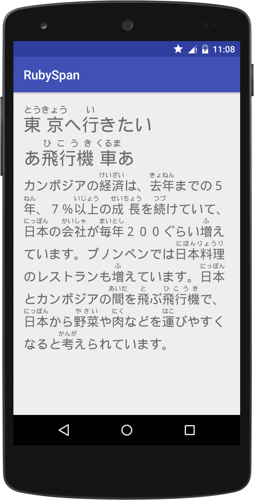

# RubySpan

#### Min SDK 21 (Android 5.0 Lollipop)

RubySpan is an attempt to display [ruby annotation](https://www.w3.org/TR/ruby/) along with text using Android TextView. Compared to the WebView solution, using RubySpan with TextView is a lot faster, flexible and more friendly to layouts. Current implementation focuses on displaying furigana on Japanese kanji. But you can easilly adapt it to your application. The minimal API supported is API 21 (Android 5.0 Lollipop). Since layouting text is a complex thing, there're still some bugs and the result is not perfect if you compare it with that produced by the browser or WebView.

### Screenshots

### Known Bugs

1. Line breaking doesn't work properly on Android pre 5.0 and it's painful to solve this. So API lower than 21 is not supported.

2. This is actually not a bug. Since RubySpan extends ReplacementSpan, it is not compatible with other (mostly) spans when used on the same text. You have to modify the source code if you want to add more features.

3. The first character of a line will not be rendered properly if it needs to be indented to display its long annotation. AFAIK, this is technically unresolvable.

4. [ReplacementSpan's bug](https://code.google.com/p/android/issues/detail?id=209437)

### License

Copyright (c) 2016 Minglangjun Li  
Licensed under the [Apache License, Version 2.0](http://www.apache.org/licenses/LICENSE-2.0.html)
